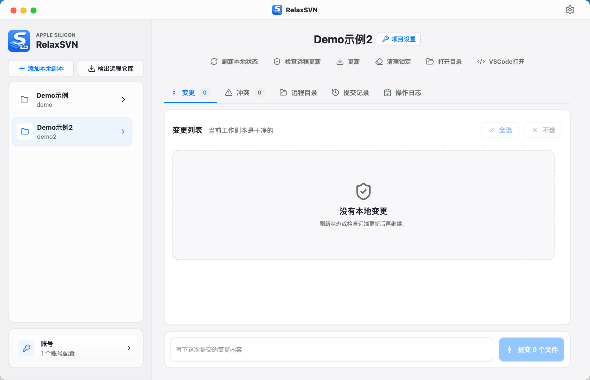
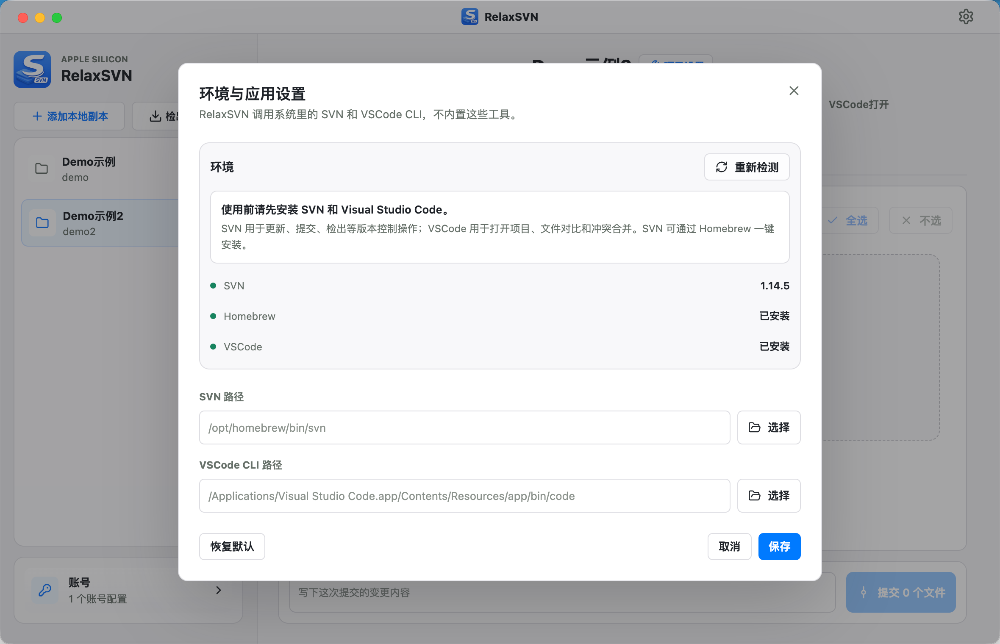
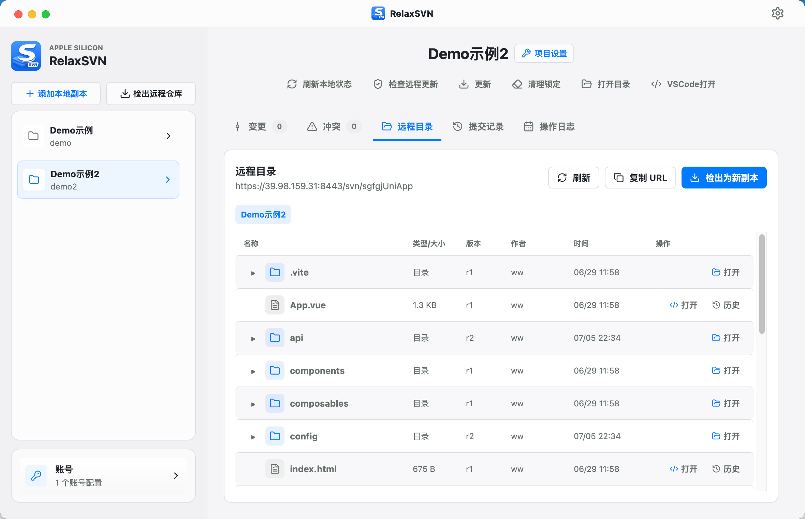

# RelaxSVN

一个现代、清爽、面向开发者的 macOS SVN 客户端。

A modern, clean macOS SVN client for developers.



Keywords: macSVN, mac SVN client, macOS SVN client, SVN GUI, Subversion GUI, SVN desktop client, Electron SVN client, Cornerstone alternative, Versions alternative, macOS Subversion client, Mac SVN 客户端, macOS SVN 图形客户端, SVN 桌面客户端.

## Why

macOS 上的 SVN 客户端常常不够顺手：有的免费版限制仓库数量，有的界面陈旧，有的操作概念不清晰。RelaxSVN 的目标很简单：让还在使用 SVN 的开发者，可以用一个更现代、更直接的桌面客户端完成日常工作。

SVN is still used in many real-world teams, but many macOS SVN clients feel dated, limited, or hard to understand. RelaxSVN focuses on the daily developer workflow: open a working copy, inspect changes, update, commit, resolve conflicts, and move on.

## Features

- Manage multiple SVN working copies
- Checkout remote repositories
- Refresh local status and check remote updates
- Update working copies or selected paths
- Commit selected local changes
- Inspect conflicts and resolve through SVN
- Open projects, diffs, and merge flows in Visual Studio Code
- Browse remote directories
- View commit history and changed paths
- Manage SVN credentials inside the app
- Detect system dependencies
- Install SVN through Homebrew when available
- Support legacy TLS / certificate retry options for older SVN servers

## Screenshots





## Requirements

- macOS on Apple Silicon
- System SVN command line tool
- Visual Studio Code is recommended for diff and conflict merge workflows
- Homebrew is recommended if you want RelaxSVN to install SVN for you

RelaxSVN does not bundle SVN or VSCode. It calls the tools installed on your system.

## Download

Download the latest signed and notarized build from GitHub Releases:

[Download RelaxSVN for macOS](https://github.com/jkopzmm/RelaxSVN/releases/latest)

下载最新版已签名、公证的 macOS 安装包：

[下载 RelaxSVN for macOS](https://github.com/jkopzmm/RelaxSVN/releases/latest)

For Apple Silicon Macs, download:

```text
RelaxSVN-0.1.0-arm64.dmg
```

Direct DMG link:

[RelaxSVN-0.1.0-arm64.dmg](https://github.com/jkopzmm/RelaxSVN/releases/download/v0.1.0/RelaxSVN-0.1.0-arm64.dmg)

Open the DMG and drag RelaxSVN to Applications.

## Development

Install dependencies:

```bash
npm install
```

Run the development app:

```bash
npm run dev
```

Type-check:

```bash
npm run typecheck
```

Build:

```bash
npm run build
```

Package for macOS arm64:

```bash
npm run dist
```

## Tech Stack

- Electron
- Vue 3
- Pinia
- Element Plus
- lucide-vue-next
- better-sqlite3

## Status

RelaxSVN is currently focused on common day-to-day SVN workflows for macOS developers. Advanced SVN workflows and edge cases may still need real-world testing and refinement.

Issues and suggestions are welcome.

## License

MIT
